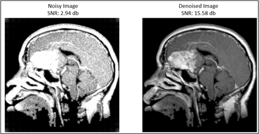

# 🧠 CT Scan Image Denoising & Brain Tumor Analysis  

## 📖 Introduction  
This project focuses on **enhancing brain CT scans** by reducing acquisition noise using a **CNN-based autoencoder**, followed by **tumor detection** on the refined images.  

The workflow ensures that critical anatomical details are preserved while improving diagnostic accuracy.  
A lightning-fast **Gradio web application** allows clinicians or researchers to instantly upload their CT scans (`.jpg`, `.png`, `.dcm` format), visualize denoised results side-by-side, and analyze the resulting improvements in Signal-to-Noise Ratio (SNR).

🚀 **Live Deployment**: Seamlessly available for free and direct public access on **Hugging Face Spaces**.

---

## 📂 Project Layout  

```plaintext
CT-Image-Denoising/
├── models/             # Saved deep learning models (autoencoder)
├── Image/              # Example images included for quick testing
├── app.py              # Pure Python Gradio UI + Inference Pipeline
├── requirements.txt    # List of Python dependencies
└── README.md           # Documentation
```

👉 **`app.py`** acts as the single entry point — handling:  
- Interactive Image uploading via Drag and Drop
- Image resizing and gray-scale normalization
- Autoencoder inference for powerful artifact structure denoising
- SNR metric & comparative improvement calculations
- The entire frontend dashboard rendered automatically

---

## 🚀 Core Features  

- 🧠 **Noise Reduction**: Custom Autoencoder directly removes CT noise while retraining critical diagnostic contours.  
- 📊 **Metrics Analysis**: Calculates the SNR of the noisy image, the denoised image, and tracks raw improvements in dB format.
- 🎨 **Responsive Dashboard**: Beautiful, responsive, mobile-friendly interface built dynamically using the `gradio` SDK.  
- 🌍 **Scalable ML Deployment**: Zero-server-hassle deployment leveraging Hugging Face Spaces optimized hardware.  

---

## 📊 Performance Snapshot  

✅ **Classification Accuracy**:  
- Before denoising → **0.37**  
- After denoising → **0.84**  

✅ **Signal-to-Noise Ratio (SNR):**  

| Condition        | SNR (dB) |
|------------------|----------|
| Raw CT (noisy)   | 2.94     |
| After Denoising  | 15.58    |

---

## 🖼️ Visual Results  

### 🔹 CT Denoising Example  
_Noise vs. Enhanced Image_  
  

---

## ⚡ Getting Started Locally  

If you wish to clone this repository and run the UI yourself:

1. Clone the repo & install dependencies via `pip`:  
   ```bash
   pip install -r requirements.txt
   ```  
2. Ensure you have the `models/autoencoder_noise.h5` model downloaded via Git LFS.
3. Run the application:  
   ```bash
   python app.py
   ```  
4. The local web server will spin up on **http://127.0.0.1:7860**.

---

## 👨‍💻 Author
📌 **Developed by:** *Shubham Vishwakarma*
📌 **Publication:** It has been Published in IEEE journal
💬 Feel free to reach out for collaboration or research discussions.  

---

✨ **In short:** This system transforms noisy CT scans into clinically useful images, leading to **better tumor detection and higher diagnostic confidence**.
